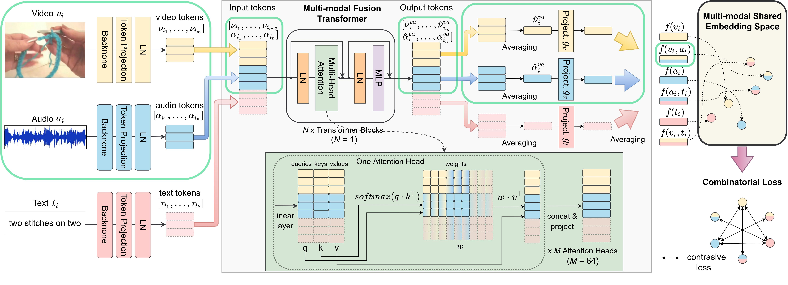

# Everything at Once – Multi-modal Fusion Transformer for Video Retrieval

Shvetsova, N., Chen, B., Rouditchenko, A., Thomas, S., Kingsbury, B., Feris, R., Harwath, D., Glass, J. and Kuehne, H., 2021. 
Everything at Once – Multi-modal Fusion Transformer for Video Retrieval.
[arXiv preprint arXiv:2112.04446.](https://arxiv.org/pdf/2112.04446.pdf)



Accepted at CVPR 2022!

Repository contains:
* the code to conduct all experiments reported in the paper
* model weights to obtain main results
* data for fine-tuning and evaluation on the YouCook2 and MSR-VTT datasets

## Get started

1. Create an environment:
   ```
   conda create python=3.6 -y -n everything_at_once
   conda activate everything_at_once 
   conda install -y pytorch==1.7.0 torchvision==0.8.0 torchaudio==0.7.0 cudatoolkit=10.2 -c pytorch
   pip install gensim==3.8.0 sacred==0.8.2 humanize==3.14.0 transformers==4.10.2 librosa==0.8.1 timm==0.4.12
   pip install neptune-contrib==0.28.1 --ignore-installed certifi
   ```
2. If needed, download `data.tar` with features and spectrograms to fine-tune 
   and evaluate on YouCook2 and MSR-VTT [here](https://drive.google.com/drive/folders/1Yhq91lQa_2cJFbtAHWfA0JYsXdWUFz9I). Extract a tar:
   `tar -xvf data.tar`
   
3. If needed, create `pretrained_models` folder and download model weights [here](https://drive.google.com/drive/folders/1Yhq91lQa_2cJFbtAHWfA0JYsXdWUFz9I):
   * [Everything-At_Once (ResNet-152,ResNeXt-101)](https://drive.google.com/file/d/13qDxS1Dr4tfswhK7FBmP2DDQ8wd5_nYN/view?usp=sharing)
   * [Everything-At_Once (ResNet-152,ResNeXt-101), fine-tuned on YouCook2](https://drive.google.com/drive/folders/1Yhq91lQa_2cJFbtAHWfA0JYsXdWUFz9I)
   * [Everything-At_Once (ResNet-152,ResNeXt-101), fine-tuned on MSR-VTT](https://drive.google.com/drive/folders/1Yhq91lQa_2cJFbtAHWfA0JYsXdWUFz9I)
   * [Everything-At_Once (S3D)](https://drive.google.com/drive/folders/1Yhq91lQa_2cJFbtAHWfA0JYsXdWUFz9I)
   * [Everything-At_Once (CLIP)](https://drive.google.com/drive/folders/1Yhq91lQa_2cJFbtAHWfA0JYsXdWUFz9I)
   * [Everything-At_Once (ResNet-152,ResNeXt-101), text-video only](https://drive.google.com/drive/folders/1Yhq91lQa_2cJFbtAHWfA0JYsXdWUFz9I)
   
   Extract a tar: 
   ```
   cd pretrained_models
   tar -xvf everything_at_once_tv.tar
   ```     

## Evaluation 

To evaluate a pretrained everything-at-once model on **the MSR-VTT dataset**, run:
```
python test.py --n_gpu 1  \
  --config configs/evaluation/msrvtt_at_once.yaml \
  --resume pretrained_models/everything_at_once_tva/latest_model.pth
```

On **the YouCook2 dataset**:
```
python test.py --n_gpu 1  \
  --config configs/evaluation/youcook_at_once.yaml \
  --resume pretrained_models/everything_at_once_tva/latest_model.pth
```

Check out `configs/evaluation` folder to find more configs 
for evaluating models trained with S3D or CLIP features, 
or using other strategies to process long videos.

## Fine-tuning 

To fine-tune the HowTo100M-pretrained model on **the MSR-VTT dataset**, run:
```
python train.py \
  --config configs/finetuning/finetune_msrvtt.yaml \
  --resume pretrained_models/everything_at_once_tva/latest_model.pth
```

Add `--neptune` key if you want to log experiments using [neptune.ai](neptune.ai) (See Experiment Logging)

On **the YouCook2 dataset**:
```
python train.py \
  --config configs/finetuning/finetune_youcook.yaml \
  --resume pretrained_models/everything_at_once_tva/latest_model.pth
```

Add `--neptune` key if you want to log experiments using [neptune.ai](neptune.ai) (See Experiment Logging)

Check out `configs/finetunning/clip` folder to find configs 
for fine-tuning with CLIP features.

## Pretraining

1. Downloading HowTo100M and feature extraction. Please note that HowTo100M videos require a huge storage, and features alone take up terabytes of space. 
   Features extraction (ResNet-152,ResNeXt-101) and audio spectrogram extraction were carefully described in [https://github.com/roudimit/AVLnet/blob/main/training.md](https://github.com/roudimit/AVLnet/blob/main/training.md).
   We will release the code for S3D and CLIP feature extraction. 

2. Review `configs/pretraining/everything_at_once_tva.yaml` and make sure `csv`, `features_path`, `features_path_audio`, and `caption_path` point on the correct paths.

3. Train `python train.py  --config configs/pretraining/everything_at_once_tva.yaml`

Add `--neptune` key if you want to log experiments using neptune.ai (See Experiment Logging)

Check out `configs/pretraining` folder to find more configs for different ablation experiments.

## Experiment Logging

This repository uses [Sacred](https://github.com/IDSIA/sacred) with a [neptune.ai](https://neptune.ai) for logging and tracking experiments.
If you want to activate this:
1. Create a [neptune.ai](https://neptune.ai) account.
2. Create a project, copy in your credentials (api_token, project_name) in `train.py` 
3. Add `--neptune` key to the training (e.g. `python train.py --neptune ..`)

## Using the model on your own data

If you want to use the model on your own data, please follow steps described in https://github.com/roudimit/AVLnet for features extraction and audio spectrogram extraction.

You may also take a look at `everything_at_once_tva.yaml`, where some comments about how to define `n_video_tokens`  and `num_audio_STFT_frames` are provided. 

## Cite

If you use this code in your research, please cite:

```bibtex
@article{shvetsova2021everything,
  title={Everything at Once--Multi-modal Fusion Transformer for Video Retrieval},
  author={Shvetsova, Nina and Chen, Brian and Rouditchenko, Andrew and Thomas, Samuel and Kingsbury, Brian and Feris, Rogerio and Harwath, David and Glass, James and Kuehne, Hilde},
  journal={arXiv preprint arXiv:2112.04446},
  year={2021}
}
```

## Contact

If you have any problems with the code or have a question, please open an issue. I'll try to answer as soon as possible.

## Acknowledgments and Licenses

The main structure of the code is based on the frozen-in-time code: https://github.com/m-bain/frozen-in-time, which itself is based  on the pytorch-template https://github.com/victoresque/pytorch-template.
Thanks for sharing good practices!

The code in `davenet.py`, `layers.py`, `avlnet.py` is partly derived from https://github.com/dharwath/DAVEnet-pytorch/, https://github.com/wnhsu/ResDAVEnet-VQ, https://github.com/antoine77340/howto100m, and https://github.com/roudimit/AVLnet, and is licensed under BSD-3 (David Harwath, Wei-Ning Hsu, Andrew Rouditchenko) and Apache License 2.0 (Antoine Miech).
